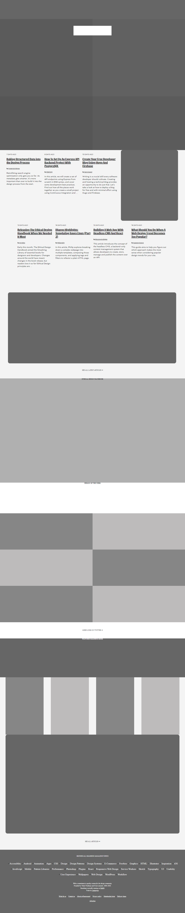

# DESIGN TEARDOWN

A design teardown of the [smashing magazine](https://smashingmagazine.com) web page.
We created a gray-scale heatmap of the website.

## Built With

- HTML,
- CSS

## Live Demo

[Live Demo Link](https://rawcdn.githack.com/anewman15/smashing-magazine-heatmap/7161ab9b02332d0cdce4abf18cb13b9ddad420a2/index.html)

To get a local copy up and running follow these simple example steps.

## Authors

👤 **Elijah Ayandokun**

- Github: [@elijahtobs](https://github.com/ElijahTobs)
- Twitter: [@elijahgr8](https://twitter.com/Elijahgr8)
- Linkedin: [ayandokunelijah](https://linkedin.com/in/ayandokunelijah)

👤 **Abdullah Numan**

- Github: [@anewman15](https://github.com/anewman15)
- Twitter: [@aanuman15](https://twitter.com/aanuman15)
- Linkedin: [aanuman15](https://www.linkedin.com/in/aanuman15/)

## 🤝 Contributing

Contributions, issues and feature requests are welcome!

Feel free to check the [issues page](issues/).

## 📝 License

This project is [MIT](lic.url) licensed.
